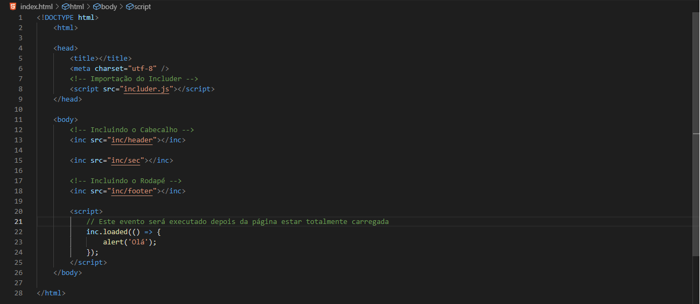
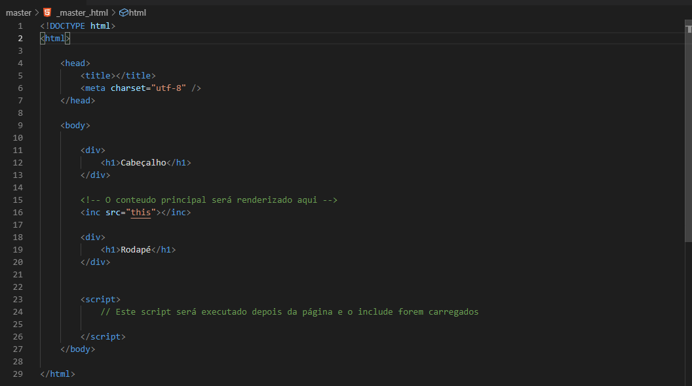

<p align="center" style="height:120px">
    
<p>

<h2 align="center"> includer.js </h2>

<p style="text-align: justify">
    Includer.js é uma ferramenta🔨 javascript para auxiliar na criação de website ou aplicações web, ela possibilita incluir partes HTML📃, como: <b>Header, Footer, Modals, etc</b>, ou mesmo criar uma página-mãe (<b>MasterPage</b>), e em todas outras páginas definir simplesmente o que deve ser renderizado.
    Há dois jeitos de usar o includer.js, como já foi dito no texto acima, <b>1º</b> usando simplesmente o <b>inc</b>, ou <b>2º</b> usando o tag inc de renderização.
</p>

<p style="text-align: justify">
    <b>Porquê usar? 🤔</b><br/>
    Quando se está criar os aplicações web💻, ou mesmo websites📰, existem secções que geralmente estão em quase todas páginas do website e usando o HTML convencional geralmente deve-se repetir as mesmas em todas as páginas, e quando se precisar alterar alguma coisa nas secções deverá se fazer em todas as páginas que elas existem.<br><br>
    O includer.js resolve esta situação, com ele o desenvolvedor tem a possibilidade de definir as secções em um só ficheiro e depois importá-lo📌 na página que deseja, tal como funciona funções <b>include e require</b> do <b>Php</b>. E também dá a possibilidade de definir uma <b>MasterPage</b> para todas as páginas, tal como funciona o <b>Asp.Net</b>. E é uma ferramenta fácil de usar.
</p>

<p style="text-align: justify">
    Para usar o <b>include</b> simples, basta importar o script na página que se deseja importar, escolher o local de preferência e definir com base a sintaxe:
</p>

``` HTML
    <inc src="[caminho do ficheiro]"></inc>
```
<p style="text-align: justify">
    <h2>☝ Notas muito importante:</h2>
    * Não é deve ser definido o a extensão do ficheiro a ser Importado. <br/>❌ Ex.: src="header.html" ; ✔ src="header"<br/> 
    * O includer oferece-se uma função que é executada depois da página ser totalmente carregada, que é: <b>docLoaded(){ ... }</b>, as funções padrão do javascript como window.onload, document.addEventListener('DOMContentLoaded', ...), etc, <b>NÃO SÃO EXECUTADOS</b>.
</p>

    Image Illustration


<hr />

<p style="text-align: justify">
    Para usar o conceito de <b>MasterPage</b>, basta primeiro criar a estrutura da MasterPage que geralmente é a estrutura base HTML, depois identificar onde o conteúdo principal está disponibilizado, com a tag <b>inc</b> com o <b>this</b> como o conteúdo do <b>src</b>. Não há necessidade de importar o includer.js na Master Page.
</p>

``` HTML
    <inc src="this"></inc>
```

    Image Illustration


<p style="text-align: justify">
    <h2>☝ Nota muito importante:</h2>
    Para este caso, o includer executa os scripts definidos na página depois dela estar totalmente carregada, e as funções padrão do javascript como window.onload, document.addEventListener('DOMContentLoaded', ...), etc, <b>NÃO SÃO EXECUTADOS</b>.
</p>

<p style="text-align: justify">
    Nas páginas que serão renderizadas, acima de tudo deverá ser importado o script do includer.js e definir uma propriedade <b>render</b>, se não for aplicado nenhum valor a ela, por padrão o includer procura pela MasterPage na <b>raiz</b> com o nome <b>_master_.html</b>, mas se a mesma estive rem uma pasta deverá ser atribuido o caminho da MasterPage como valor na propriedade.
</p>

``` HTML
    <!-- Para o caso em que a MasterPage estiver na raiz e 
    tiver o nome _master_.html -->
    <script src="includer.js" render></script>

    <!-- Para o caso em que a MasterPage estiver em uma pasta -->
    <script src="includer.js" render="shared/_master_"></script>
```

<p style="text-align: justify">
    Depois de ter sido importado o script estás livre de avançar com o seu código.
</p>

``` HTML
    <script src="includer.js" render></script>

    <div>
        <h1>Este é o meu conteúdo principal</h1>
        <a href="/home.html">Ir para Home Page</a>
    </div>

    <script>
        console.log('Olá');
    </script>
```

<h3 style="text-align: justify">
    A Ordem de estruturação é muito importante🤞, por causa da ordem de leitura dos navegadores!! 
</h3>

<p align="center" style="font-size:11pt; margin:0;"> 
    Thanks a lot for visiting easy.js repo 🙂, I hope you enjoyed!! 👌<br/>
    <h4 align="center">Salute 😃</h4> 
</p>
<br/>

<p align="center" style="font-size:11pt; margin:0;"> 
    © 2019, Afonso Matumona Elias 
</p>