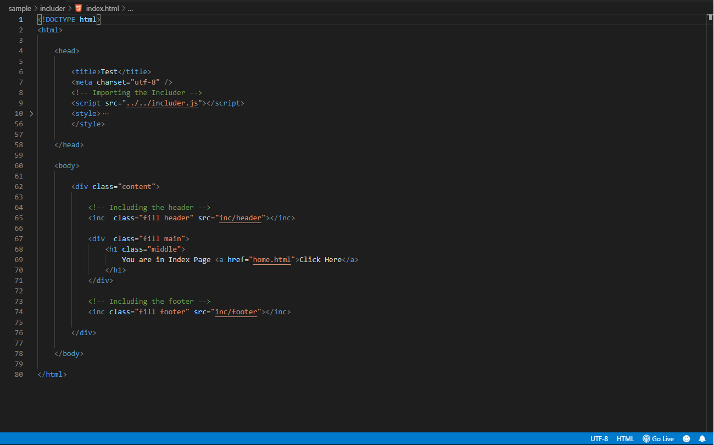
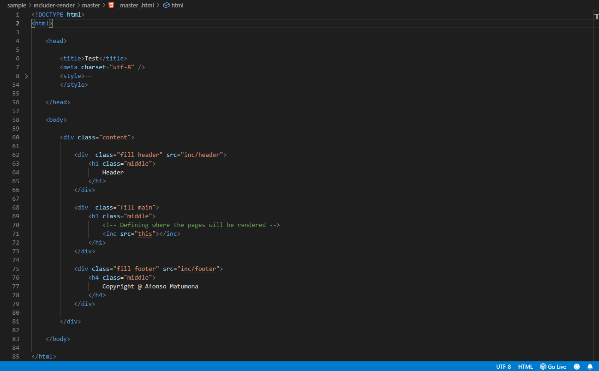

<p align="center" style="height:120px">
    
<p>

<h2 align="center"> includer.js </h2>

<p style="text-align: justify">
    Includer.js is a javascript tool🔨 to assist in the creation of websites or web applications, it makes it possible to include HTML📃 parts, such as: <b>Header, Footer, Modals, etc</b>, or even create a <b>MasterPage</b>, and on the others pages simply define what should be rendered. There are two ways to use includer.js, as stated in the text above, <b>1st</b> simply using inc, or <b>2nd</b> using the rendering inc tag.

</p>

<p style="text-align: justify">
    <b>Why use? 🤔</b><br/>
    When you are creating web applications💻, or even websites📰, there are sections that are usually on almost every page of the website and using conventional HTML you should usually repeat them on every page, and when you need to change something in sections should be done on every page they exist.<br><br>
    Includer.js solves this situation, with it the developer will be able to define the section in a single file and then import📌 it into the page they want, just as <b>Php's include and require</b> functions work. It also gives you the ability to set a <b>MasterPage</b> for all pages as <b>Asp.Net</b> works. And it's an easy tool to use😎.
</p>

<p style="text-align: justify">
    To use simple <b>include</b>, simply import the script into the page you want to include, choose the preferred location, and set it based on syntax:
</p>

``` HTML
    <inc src="[filepath]"></inc>
```
<p style="text-align: justify">
    <h2>☝ Very important notes:</h2>
    * The file extension to be included must not be defined. <br/>❌ Eg.: src="header.html" ; ✔ src="header"<br/> 
    * Includer offers a function that executes after the page is fully loaded, which is: <b>inc.loaded (function (e) {...})</b>, like the standard javascript functions <b>window.onload, document.addEventListener ( 'DOMContentLoaded', ...), etc</b>, but these functions cannot be used because <b>THEY ARE NOT EXECUTED</b>.
</p>

    Image Illustration


<hr />

<p style="text-align: justify">
    To use <b>include render</b> (which has the concept of <b>MasterPage</b>), simply create the MasterPage structure which is usually the base HTML structure, then identify where the main content will be made available, with the <b>inc</b> tag with <b>this</b> as the <b>src</b> property content. There is no need to import includer.js into the MasterPage.
</p>

``` HTML
    <inc src="this"></inc>
```

    Image Illustration


<p style="text-align: justify">
    <h2>☝ Very importante note:</h2>
    In this case, includer runs the scripts defined on the page after it is fully loaded, and the standard javascript functions like <b>window.onload, document.addEventListener ('DOMContentLoaded', ...), etc</b>, <b>ARE NOT EXECUTED</b>, but includer <b>inc.loaded(function (e) {...})</b> function is executed (it can be used as non, but we advise using it).
</p>

<p style="text-align: justify">
    For pages that will be rendered, the first one should be imported the includer.js script and set a <b>render</b> property, if it is set without value to it, by default includer will look for MasterPage in the <b>root</b> with the name <b>_master_.html</b>, but if it is into a folder, the MasterPage path must be assigned as the property value.
</p>

``` HTML
    <!-- In case where MasterPage is in the root and has the name _master_.html -->
    <script src="includer.js" render></script>

    <!-- In case MasterPage is in a folder -->
    <script src="includer.js" render="shared/_master_"></script>
```

<p style="text-align: justify">
    Once you have imported the script you can proceed with the common code.
</p>

    Image Illustration


<p style="text-align: justify">
    * When using the simple includer, the argument of the function that is passed by inc.loaded((<span style="color:red">e</span>) => { ... }), is the <b>DOMContentLoaded</b> event.<br>
    * When using include render, the argument of the function that is passed by inc.loaded((<span style="color:red">e</span>) => { ... }), is the <b>document</b> element.
</p>

<h3 style="text-align: justify">
    Structuring Order is very important🤞, because of the browser's code reading order!
</h3>

<p align="center" style="font-size:11pt; margin:0;"> 
    Thanks a lot for visiting includer.js repo 🙂, I hope you enjoyed!!! 👌<br/>
    <h4 align="center">Salute 😃</h4> 
</p>
<br/>

<p align="center" style="font-size:11pt; margin:0;"> 
    © 2019, Afonso Matumona Elias 
</p>