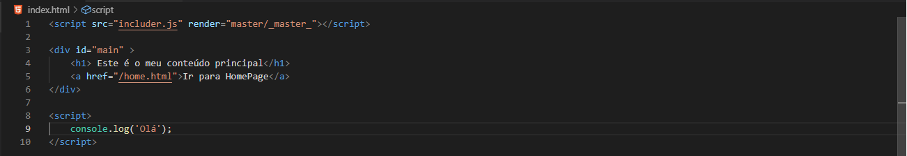

<p align="center" style="height:120px">
    
<p>

<h2 align="center"> includer.js </h2>

<hr>

<p style="text-align: justify">
    Includer.js é uma ferramenta🔨 javascript para auxiliar na criação de website ou aplicações web, ela possibilita incluir partes HTML📃, como: <b>Header, Footer, Modals, etc</b>, ou mesmo criar uma página-mãe (<b>MasterPage</b>), e em todas outras páginas definir simplesmente o que deve ser renderizado.
    Há dois jeitos de usar o includer.js, como já foi dito no texto acima, <b>1º</b> usando simplesmente o <b>inc</b>, ou <b>2º</b> usando o tag inc de renderização.
</p>

<p style="text-align: justify">
    <b>Porquê usar? 🤔</b><br/>
    Quando se está criar os aplicações web💻, ou mesmo websites📰, existem secções que geralmente estão em quase todas páginas do website e usando o HTML convencional geralmente deve-se repetir as mesmas em todas as páginas, e quando se precisar alterar alguma coisa nas secções deverá se fazer em todas as páginas que elas existem.<br><br>
    O includer.js resolve esta situação, com ele o desenvolvedor terá a possibilidade de definir a secção em um só ficheiro e depois importá-lo📌 na página que deseja, tal como funciona as funções <b>include</b> e <b>require</b> do <b>Php</b>. Ele também dá a possibilidade de definir uma <b>MasterPage</b> para todas as páginas, tal como funciona o <b>Asp.Net</b>. E é uma ferramenta fácil de usar😎.
</p>

<p style="text-align: justify">
    Para usar o <b>include</b> simples, basta importar o script na página que se deseja incluir, escolher o local de preferência e definí-lo com base a sintaxe:
</p>

``` HTML
    <inc src="[caminho do ficheiro]"></inc>
```
<p style="text-align: justify">
    <h2>☝ Notas muito importante:</h2>
    * Não é deve ser definido a extensão do ficheiro a ser incluido. <br/>❌ Ex.: src="header.html" ; ✔ src="header"<br/> 
    * O includer oferece-se uma função que é executada depois da página ser totalmente carregada, que é: <b>inc.loaded(function (e) { ... })</b>, que nem as funções padrão do javascript <b>window.onload, document.addEventListener('DOMContentLoaded', ...)</b>, etc, mas estas funções não podem ser usadas porque <b>ELAS NÃO SÃO EXECUTADAS</b>.
</p>

    Image Illustration


<hr />

<p style="text-align: justify">
    Para usar o <b>include render</b>(que tem conceito de <b>MasterPage</b>), basta primeiro criar a estrutura da MasterPage que geralmente é a estrutura base HTML, depois identificar onde o conteúdo principal estará disponibilizado, com a tag <b>inc</b> com <b>this</b> como o conteúdo da propriedade <b>src</b>. Não há necessidade de importar o includer.js na MasterPage.
</p>

``` HTML
    <inc src="this"></inc>
```

    Image Illustration


<p style="text-align: justify">
    <h2>☝ Nota muito importante:</h2>
    Para este caso, o includer executa os scripts definidos na página depois dela ser totalmente carregada, e as funções padrão do javascript como <b>window.onload, document.addEventListener('DOMContentLoaded', ...), etc</b>, <b>TAMBÉM NÃO SÃO EXECUTADAS</b>, mas a função do includer <b>inc.loaded(function (e) { ... })</b> é executada (ela pode ser usada como não, mas aconselhamos usá-la).<br>
</p>

<p style="text-align: justify">
    Para páginas que serão renderizadas, a primeiro deverá ser importado o script do includer.js e definir uma propriedade <b>render</b>, se for definido sem valor a ela, por padrão o includer procurará pela MasterPage na <b>raiz</b> com o nome <b>_master_.html</b>, mas se a mesma estiver em uma pasta deverá ser atribuido o caminho da MasterPage como valor da propriedade. Para definir do titulo da página basta definir um atributo <b>title</b> com o valor desejado no script corrente.
</p>

``` HTML
    <!-- Para o caso em que a MasterPage estiver na raiz e 
    tiver o nome _master_.html -->
    <script src="includer.js" render title="Página Principal"></script>

    <!-- Para o caso em que a MasterPage estiver em uma pasta -->
    <script src="includer.js" render="shared/_master_" title="Página Inicial"></script>
```

<p style="text-align: justify">
    Depois de ter sido importado o script pode-se avançar com o código comum.
</p>

    Image Illustration


<p style="text-align: justify">
    * Quando se estiver a usar o includer simples, o argumento da função que é passada pelo inc.loaded((<span style="color:red">e</span>) => { ... }), é o evento <b>DOMContentLoaded</b>.<br>
    * Quando se estiver a usar o include render, , o argumento da função que é passada pelo inc.loaded((<span style="color:red">e</span>) => { ... }), é o elemento <b>document</b>.
</p>

<h3 style="text-align: justify">
    A Ordem de estruturação é muito importante🤞, por causa da ordem de leitura de códigos dos navegadores!
</h3>

<p style="text-align: justify">
    Usando o includer-render, também temos a possibilidade de mudar de páginas sem que 
    recarregue, por padrão todas todas as mudanças são feitas com recarregamento da página
    para reconstruí-la, para atingir o efeito de mudar de página sem recarregamento dela deve-se ter em consideração as âncoras (tag <b>a</b>), definindo que nelas os atributos: <b>reload e pTitle</b>.
    <ul>
        <li><b>reload</b>, ele controla o evento de <b>click</b> do elemento, fazendo que a página que será chamada seja injetada no elemento com a tag <b>inc</b> e o atributo <b>src</b> ou no elemento com o atributo <b>inc-src</b>. </li>
    </ul> 
    <ul>
        <li><b>pTitle</b>, ele permite configurar o texto do título (tag <b>title</b>) da página depois da nova página for injetada para o valor que for definido a ele.</li>
    </ul> 
</p>

``` HTML
    <script src="includer.js" title="Main Page"></script>
    <!-- O que o includer entende quando estes attributos são definidos:
    * reload - recarregue somente o conteúdo principal.
    * pTitle - depois de recarregares dá este titulo. -->
    <label> You are in Index Page <a href="home.html" reload pTitle="Home Page">Click Here</a></label>
```

<p style="text-align: justify">
    Está funcionalidade vem acompanhada com a função <b>inc.added(function(e){ ... })</b>, que é disparado sempre que a nova página é injetada, e a mesma é passada como argumento da função.<br>
    Obs ☝: Deve ser usado no interior da função principal <b>inc.loaded(function(e){ ... })</b>.
</p>

<p style="text-align: justify">
    Se não quisermos usar a tag do includer (<b>inc</b>), também podemos usar as tags padrão do HTML e ainda conseguir incluir as secções desejadas, para isso é temos que definir o attributo <b>inc-src</b> no elemento em que desejamos que o conteúdo seja injetado.  
</p>

``` HTML
    <!-- Including the header -->
    <header class="myHeader" inc-src="inc/header"></header>
    
    <!-- Including the main content -->
    <main class="myMain" inc-src="inc/main"></main>

    <!-- Including the footer -->
    <footer class="myFooter" inc-src="inc/footer"></footer>
```

<h3 style="text-align: justify">
    😀 Os includes podem ser adicionados dinâmicamente com javascript, por tanto é ideal para construir aplicações do tipo <b>SPA</b> (Single Page Application) 😎.
</h3>

<hr>
<br>
<br>

<p align="center" style="font-size:11pt; margin:0;"> 
    Thanks a lot for visiting includer.js repo 🙂, I hope you enjoyed!!! 👌<br/>
    <h4 align="center">Salute 😃</h4> 
</p>
<br/>

<p align="center" style="font-size:11pt; margin:0;"> 
    © 2019, Afonso Matumona Elias 
</p>